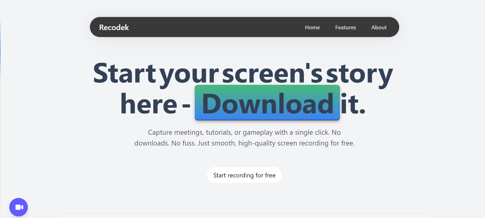

# React Screen & Webcam Recorder

A browser-based screen and webcam recording application built with React. Record your screen and webcam simultaneously with the webcam appearing as a picture-in-picture overlay in the bottom-right corner.

##  Features

* **Simultaneous Recording:** Capture your screen and webcam at the same time.
* **Real-time Overlay:** Webcam appears as a picture-in-picture overlay (20% of screen width).
* **Audio Capture:** Records system audio directly from the screen capture.
* **Live Preview:** See your webcam feed before and during recording.
* **Recording Timer:** Track your recording duration in real-time.
* **Browser-Native:** No external dependencies, backend servers, or extensions required.
* **Download Options:** Save your recording immediately as a WebM file.

---

## Technologies Used

* **[React](https://reactjs.org/)** - UI framework
* **[Tailwind CSS](https://tailwindcss.com/)** - Styling
* **[Lucide React](https://lucide.dev/)** - Icons
* **HTML5 Canvas API** - Real-time video composition
* **MediaRecorder API** - Video recording
* **MediaDevices API** - Screen and webcam capture

---
##  Usage

1.  **Start Recording**
    * Click the **"Start Recording"** button.
    * Grant permission for screen sharing when prompted by the browser.
    * Grant permission for webcam access when prompted.
    * Recording begins immediately with a timer display.

2.  **During Recording**
    * The timer shows your current recording duration.
    * Your webcam feed appears in the preview window.
    * The webcam will be overlaid in the bottom-right corner of your screen recording.

3.  **Stop Recording**
    * Click the **"Stop Recording"** button.
    * The recording will process automatically.
    * A preview player will appear once processing is complete.

4.  **Download**
    * Review your recording in the preview player.
    * Click **"Download Recording"** to save the file.
    * File is saved as `screen-recording.webm`.

---

## Technical Details

### How It Works
1.  **Stream Capture:** The app captures two separate video streams:
    * Screen capture using `getDisplayMedia()`
    * Webcam capture using `getUserMedia()`
2.  **Real-time Composition:** An HTML5 Canvas combines both streams:
    * Screen video is drawn as the base layer.
    * Webcam video is overlaid in the bottom-right corner at 20% width.
    * Canvas updates at 30 FPS using `requestAnimationFrame()`.
3.  **Recording:** The combined canvas stream is recorded using `MediaRecorder`:
    * Video codec: VP8
    * Audio codec: Opus
    * Container: WebM
    * Chunk interval: 1 second
4.  **Output:** Recording chunks are combined into a `Blob` and made available for download.

